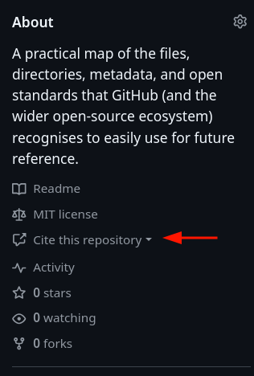
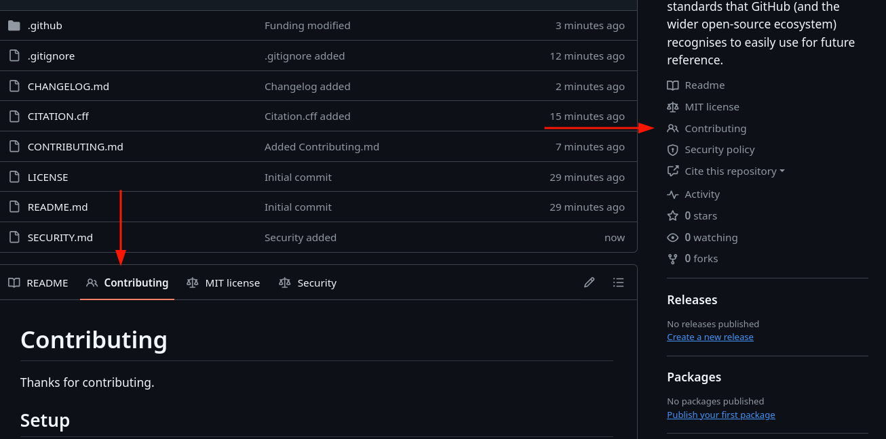
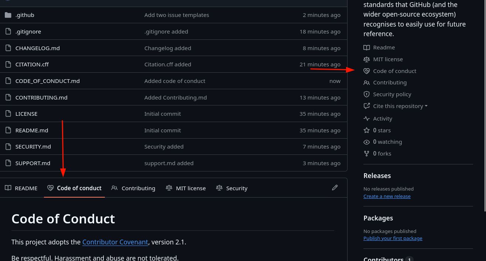
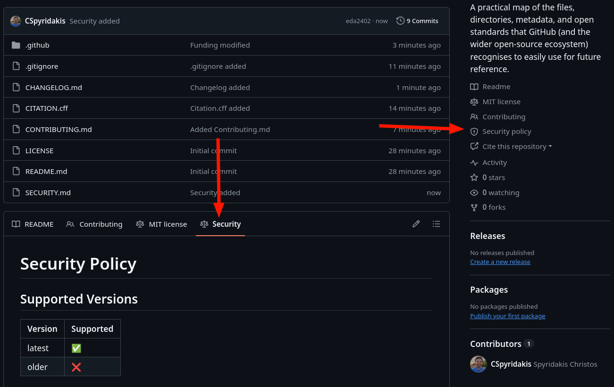
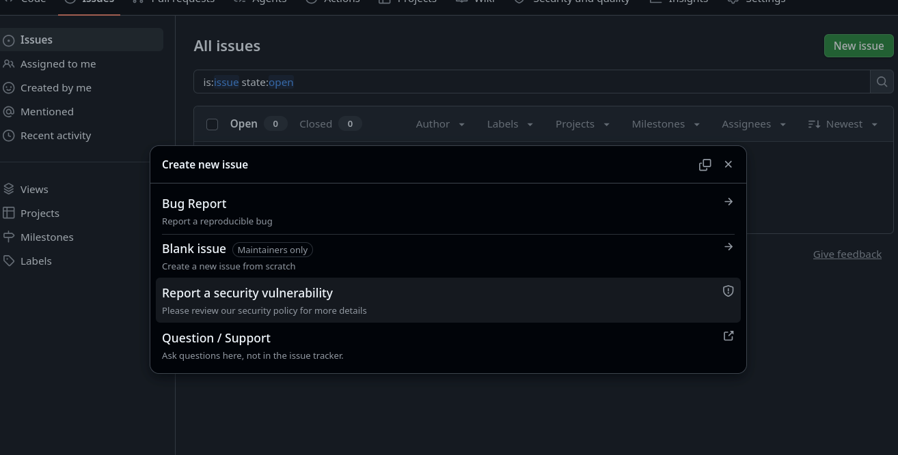

# Open-Source Collaboration Repo Skeleton Files 

> A collection of skeleton files that a community-health, well-formed public 
> repository is expected to have. Every file is a **minimal
> template** carrying a short explanation and a dummy body to extend.

---

## How to use

1. Easy reference here about the file name and base structure.
2. Copy the content of the file and create a new one into the respective project.

**Placement rule:** community-health files (`CONTRIBUTING`, `CODE_OF_CONDUCT`,
`SECURITY`, `SUPPORT`) resolve `.github/` -> root -> `docs/`, first found wins.
This template keeps docs at root and GitHub config under `.github/`.

---

## Files

### 1. Core

- **[README.md](README.md)**: repo front page. Replace with your project's requirements, see [docs](https://docs.github.com/repositories/managing-your-repositorys-settings-and-features/customizing-your-repository/about-readmes)

- **[LICENSE](LICENSE)**: legal terms. This one is MIT, see [choosealicense](https://choosealicense.com) or [SPDX list](https://spdx.org/licenses/)

- **[CHANGELOG.md](CHANGELOG.md)**: notable changes per release, see [Keep a Changelog](https://keepachangelog.com/) or [SemVer](https://semver.org/)

- **[CITATION.cff](CITATION.cff)**: machine-readable citation, adds a "Cite this repository" button, see [Citation File Format](https://citation-file-format.github.io/) or [docs](https://docs.github.com/repositories/managing-your-repositorys-settings-and-features/customizing-your-repository/about-citation-files)
  

---

### 2. Community & governance

- **[CONTRIBUTING.md](CONTRIBUTING.md)**: setup, branch, commit, test, PR flow.
  Linked by GitHub on new issues/PRs, see [docs](https://docs.github.com/communities/setting-up-your-project-for-healthy-contributions/setting-guidelines-for-repository-contributors)
  

- **[CODE_OF_CONDUCT.md](CODE_OF_CONDUCT.md)**: behaviour rules + reporting. Set the enforcement contact, see [Contributor Covenant](https://www.contributor-covenant.org/) or [docs](https://docs.github.com/communities/setting-up-your-project-for-healthy-contributions/adding-a-code-of-conduct-to-your-project)
  

- **[SECURITY.md](SECURITY.md)**: private vulnerability disclosure policy, shown on the Security tab, see [docs](https://docs.github.com/code-security/getting-started/adding-a-security-policy-to-your-repository) or [Private Vulnerability Reporting](https://docs.github.com/code-security/security-advisories/working-with-repository-security-advisories/configuring-private-vulnerability-reporting-for-a-repository)
  

- **[SUPPORT.md](SUPPORT.md)**: where to get help vs where to file bugs, see [docs](https://docs.github.com/communities/setting-up-your-project-for-healthy-contributions/adding-support-resources-to-your-project)

- **[GOVERNANCE.md](GOVERNANCE.md)**: decision model, roles, adding maintainers, see [opensource.guide](https://opensource.guide/leadership-and-governance/)

- **[MAINTAINERS.md](MAINTAINERS.md)**: human list of maintainers (distinct from CODEOWNERS), see [opensource.guide](https://opensource.guide/best-practices/)

---

### 3. `.github/` configuration

- **[.github/CODEOWNERS](.github/CODEOWNERS)**: auto-requests reviewers by path, enforceable via branch protection, see [docs](https://docs.github.com/repositories/managing-your-repositorys-settings-and-features/customizing-your-repository/about-code-owners)

- **[.github/FUNDING.yml](.github/FUNDING.yml)**: drives the Sponsor button, see [docs](https://docs.github.com/repositories/managing-your-repositorys-settings-and-features/customizing-your-repository/displaying-a-sponsor-button-in-your-repository)

- **[.github/dependabot.yml](.github/dependabot.yml)**: automated dependency + action update PRs, see [docs](https://docs.github.com/code-security/dependabot/dependabot-version-updates/configuration-options-for-the-dependabot.yml-file)

- **[.github/PULL_REQUEST_TEMPLATE.md](.github/PULL_REQUEST_TEMPLATE.md)**: default PR body, see [docs](https://docs.github.com/communities/using-templates-to-encourage-useful-issues-and-pull-requests/creating-a-pull-request-template-for-your-repository)

- **[.github/ISSUE_TEMPLATE/bug_report.yml](.github/ISSUE_TEMPLATE/bug_report.yml)**: structured bug reports (Issue Forms), see [forms syntax](https://docs.github.com/communities/using-templates-to-encourage-useful-issues-and-pull-requests/syntax-for-githubs-form-schema)

- **[.github/ISSUE_TEMPLATE/config.yml](.github/ISSUE_TEMPLATE/config.yml)**:
  issue chooser, redirects questions, see [docs](https://docs.github.com/communities/using-templates-to-encourage-useful-issues-and-pull-requests/configuring-issue-templates-for-your-repository)
  

- **[.github/workflows/ci.yml](.github/workflows/ci.yml)**: CI on push/PR/cron see [Actions docs](https://docs.github.com/actions/using-workflows/about-workflows)

---

### 4. Git & editor config

- **[.gitignore](.gitignore)**: files Git must not track, see [git docs](https://git-scm.com/docs/gitignore) or [templates](https://github.com/github/gitignore)

- **[.gitattributes](.gitattributes)**: line endings, Linguist, LFS per path, see [git docs](https://git-scm.com/docs/gitattributes) or [Linguist](https://github.com/github-linguist/linguist/blob/master/docs/overrides.md)

- **[.editorconfig](.editorconfig)**: editor-agnostic formatting, see [editorconfig.org](https://editorconfig.org/)

- **[.mailmap](.mailmap)**: normalise duplicate contributor identities, see [git docs](https://git-scm.com/docs/gitmailmap)

- **[.well-known/security.txt](.well-known/security.txt)**: RFC 9116 machine-readable security contact, see [securitytxt.org](https://securitytxt.org/) or [RFC 9116](https://www.rfc-editor.org/rfc/rfc9116)

---

## 5. Conventions worth adopting

- **[Conventional Commits](https://www.conventionalcommits.org/)**: parseable commit messages that drive versioning and changelogs.

- **[Semantic Versioning](https://semver.org/)**: `MAJOR.MINOR.PATCH`.

- Branch protection: required reviews, status checks, CODEOWNERS review.
